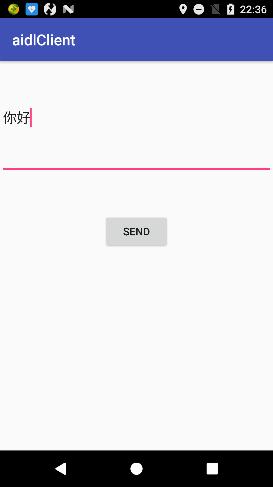
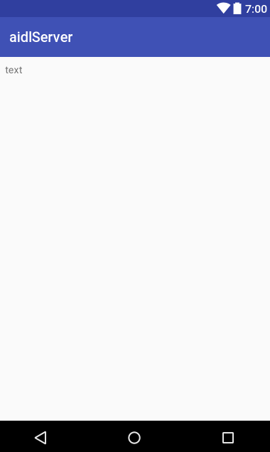

# android-AIDI-sample
两个应用之间使用AIDL进行通信的例子
A应用去绑定B应用的service ，B应用的service被绑定之后会返回一个Binder对象，A应用通过这个Binder对象向B应用发送消息，B应用的service接收消息并做处理。这和四大组件中的service和activity通信的方法有异曲同工之处，只不过Binder对象换成了MessageCenter.Stub

 
 

 
 
